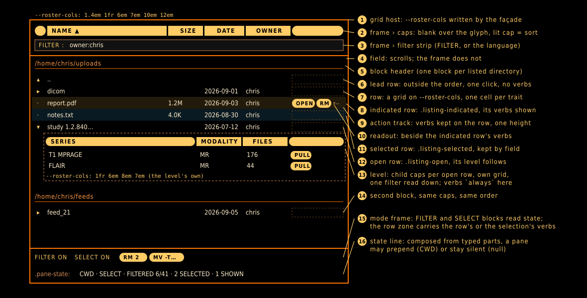

= ARGUS components: the reference
Rudolph Pienaar <rudolph.pienaar@gmail.com>
:doctype: article
:toc: left
:toclevels: 3
:sectnums:
:icons: font

[abstract]
== Abstract

AEGIS (`aegis.adoc`) is the doctrine: what the surface is, and the laws it keeps. This document is the reference beneath it: the components a pane is built from, one section each, in the shape a component library owes its users. A section says what the component is for, what it looks like (its anatomy, drawn and labelled in `images/`, and once the component is on stage, photographed in each of its states by the smoke driver), what a pane declares to get one, the states it can be in, the laws it carries so a pane does not have to, the stylesheet hooks it wears, and what not to do with it.

A component lands with its section, in the same pull request, and the section is amended by every slice that changes the component. A section, like the component it describes, speaks the component's own vocabulary and names no theme: colour reaches a component as tokens, and the doctrine above this reference is where the theme is named. The lint gate holds this table to the tree: every section names its source, and the sources that are components must have a section.

== Reading a section

Each section follows one order. *Purpose* says what the component answers. *Anatomy* opens with the drawing, then names its parts, outermost first, with the class each part wears; a component on stage adds a picture per state. *Declaration* is the TypeScript a pane writes, complete, with every optional field explained. *States* are the classes a part can wear and what puts them there. *Laws* names the AEGIS laws the component expresses as consequences of its declaration. *Stylesheet* lists the custom properties and selectors a theme may touch and the ones it may not. *Do not* lists the ways the component has been misused, or would be.

== Listing

Source: `apps/argus/src/features/roster/listing.ts` (the façade), over `order.ts` (sort and filter), `host.ts` (frame and field) and `row.ts` (traits, actions, progress, expansion).

Status: on stage in every tabular pane — the browser (2026-09-07, S2), the runs roster (2026-09-08, S3) and PACS with its three levels (2026-09-08, S4). No pane composes a listing by hand; the lint fails one that tries. The browser was the first pane converted, and its conversion is what turned this section from a declaration into a description of a thing that runs.

=== Purpose

A listing shows rows of one kind under column caps that sort them, behind a filter strip that narrows them, with a frame that stays while the rows scroll. It is the one tabular pattern of the surface: a directory's entries, a session's feeds, a query's studies and their series are all listings. A pane declares one and calls `rows_set`; it never assembles caps, strip, track or selection itself.

=== Anatomy

.The listing, numbered: frame and field, a block with a lead row, an indicated row with its verbs and readout, a selected row, an open row with its level, a second block, and the chrome that reads its state

[cols="1,1,3"]
|===
| Part | Class | Holds

| grid host | (the mount, or `gridHost`) | The custom property `--roster-cols`, written by the façade from the traits. Every part below reads it.
| frame | `.roster-order` | The caps row and the filter strip, seated at the head of the mount, never re-inserted.
| caps | `.roster-caps` › `.roster-cap` | One cap per capped trait, blank cells over uncapped traits; the active cap wears `.roster-active` and its direction glyph.
| strip | `.roster-filter` › `.roster-filter-input` | The filter, hidden until FILTER or the language opens it.
| field | `.listing-field` | The scrolling region beneath the frame, opened fresh on every render.
| block | `.listing-block` | One group of rows: a header when given, its own caps when `caps: 'each'`, then its rows or its painted form.
| rows | `.listing-rows` | The rows of one block.
| row | `.listing-row` | A grid on `--roster-cols`: one cell per trait, then the action track when actions are declared.
| cell | (the trait's `className`) | What one trait says about one row.
| action track | `.listing-actions` | Reserved on every row at one declared height; holds the verbs of the indicated row, or every row's under `always`.
| verb | `.listing-action` | One capsule, one command.
| readout | `.listing-readout` | Words beside the verbs, about the indicated row only.
| level | `.listing-level` | A child listing beneath an open row: its own `--roster-cols`, its own caps, its rows.
| selection bar | `.<prefix>-selection-bar` | The verbs of the selection, on the mode frame, present while SELECT is on and something is selected.
|===

=== Declaration

[source,ts]
----
const listing = new Listing<FsListingEntry>({
  mount: panel,                       // the listing region
  traits: FILE_TRAITS,                // columns, each with a width; an uncapped one leads
  key: (entry) => entry.path,         // one string per row
  chrome: { root: pane, prefix: 'files' },
  actions: { width: '21em', of: (entry) => verbs_for(entry) },
  activate: (entry) => open(entry),
  activatable: (entry) => entry.type !== 'unknown',
  indicated: (entry) => regard_write(entry.path),
  row: { className: (entry) => `files-type-${entry.type}`, decorate: (el, entry) => { el.title = entry.path; } },
  selection: { verbs: (rows) => selectionVerbs_for(rows) },
  state: (parts) => ['CWD', listingState_compose(parts)].filter(Boolean).join(' · '),
  defaultSort: { key: 'name', dir: 'asc' },
});
listing.rows_set([{ key: '/x', lead: [UP], rows: entries }], { field: '/x' });
----

[cols="1,3"]
|===
| Field | Meaning

| `mount` | The listing region. The frame seats at its head; the field opens beneath it.
| `traits` | The columns, in cap order. Each is a `ListingTrait`: key, label, `className`, `cell`, optional `compare`, and its `width` (a CSS grid track, required by the façade). `capped: false` makes a leading ornament: a track and a cell, no cap, no sort. Uncapped traits must lead; the façade refuses a declaration where one follows a capped trait.
| `key` | A row's identity as a string. Indication, selection, readouts and `row_element` are all keyed by it.
| `gridHost` | Where `--roster-cols` is written; defaults to the mount. A pane whose query form stands on the same grid outside the mount names an ancestor of both, and `template_get()` gives the form the template.
| `chrome` | The pane root and the block prefix. The façade finds `.pane-state`, `.<prefix>-filter`, `.<prefix>-select` and `.<prefix>-selection-bar` under the root, binds them, and listens for `argus:roster` on the root. Absent, the listing has no chrome and writes no state line.
| `caps` | `root` (default) keeps one caps row in the frame; `each` mints a caps row at the head of every block instead, all reading one sort.
| `actions` | Declaring this mints the action track: a track of `width` on every row, empty until the row is indicated, then holding `of(row)`. `always: true` draws every row's verbs at once and the click activates instead of indicating.
| `activate` | What activating a row does. With a `child`, activation also folds the row open or closed.
| `activatable` | Whether a row answers a click; absent means every row does. A row that does not wears no cursor and no listener.
| `indicated` | Told when a row is indicated, for the regard.
| `row` | The pane's own row-level concerns: extra classes (row state marks a row, not a column) and a decorator for title, dataset, whatever else.
| `selection` | Declaring this makes the listing able to SELECT: `verbs(rows)` gives the bar's verbs for the current selection, each one command over many operands.
| `state` | Composes the state line from typed parts (`filter`, `selecting`, `selected`, `shown`). Absent, `listingState_compose` writes `SELECT · FILTERED n/m · k SELECTED · s SHOWN`, each part only when it has something to say. Returning null leaves the span untouched, for a pane whose bar is saying something else.
| `defaultSort` | The initial sort.
| `child` | The level beneath: `listingChild_declare(of, declaration)`, where `of` gives a row's children and `declaration` is a `ListingLevel` for them (traits, key, actions, activate, its own `child`). A row that heads a level is wrapped with it in a `.listing-group` (plus `row.groupClassName`), which wears `.listing-open` while the row is open; the level beneath carries `data-depth` (1, 2, …) so a stylesheet indents by depth. The child's caps are minted per open row on the child's own grid, the parent's filter is read down the levels, and a parent survives the filter when a child matches. Activating a row folds it; `open_set(depth, keys)` holds rows open programmatically and `open_clear()` closes every level; `template_get(depth)` gives a form the level's template.
| `empty` | What the field says when blocks were set but hold no rows (an answer with nothing in it), as against no blocks at all (no answer yet), which says nothing.
|===

The methods a pane calls afterwards: `rows_set(blocks, { field })`, `row_indicate(key | null)`, `indicated_get()`, `readout_show(key, text)`, `row_element(key)`, `template_get()`, `painter_set(paint | null)`, `filter_toggle(open?)`, `select_toggle(on?)`, `select_isOn()`, `selection_get()`, `state_refresh()`.

A block is `{ key, header?, lead?, rows }`. A flat listing passes one; a browser listing several directories passes one per directory with a header each. `lead` rows are drawn before the ordered rows and stand outside the order: never sorted, filtered, counted, selected or given verbs; a single click activates them. The browser's `..` is one. A painter (`painter_set`) draws a block some other way, cards say, and receives the rows already ordered; a painted block has no grid, so its rows carry no track and no indication, and the painter owns what a click means.

As the browser uses it: one block per listed directory, each led by its `..` as a lead row; the row type carries the entry and the full path it sits at, since a listed name does not know its own directory. The card and preview projections are a painter; the cwd binding, the stale readout and the content views (a file, an image, a /bin entry) are the browser's own, layered around the listing rather than inside it. A node overlay declares no verbs, so it mints no action track and keeps its single click — the case the reserved track would otherwise have spent a column on.

As PACS uses it: three levels, patient over study over series; the fold glyph is each folding row's own uncapped leading trait, drawn by the stylesheet from the group's open state; a level of one row is opened with `open_set`; the study and series verbs stand on every row (`always`); the workspace carries the study template from `template_get(1)` for the form; the summed progress bars and the per-series badges remain the pane's, painted into mounts its own cells register.

As the roster uses it: one block, the constant field `roster`; PROGRESS is the expanse right after TITLE; the surface's row verbs are declared at construction (a roster given none keeps its single click); a feed's arrival pulse is a mark toggled on `row_element(key)` between renders; and the state composer yields the bar to the graph (returns null) whenever a graph rather than the roster is on stage. The pane's forwarders stringify the feed id at the boundary, since the façade keys rows by string.

=== States

[cols="1,1,3"]
|===
| State | Class | Put there by

| indicated | `.listing-indicated` on the row | A click on a row of a listing with actions, or `row_indicate(key)`. Exactly one row at a time; the previous row's track empties. Cleared by every render.
| selected | `.listing-selected` on the row | A click while SELECT is on, on a governed row. Kept across renders of the same field.
| selecting | `.listing-selecting` on the mount | `select_toggle`. The SELECT block reads `SELECT ON` and loses `rail-off`.
| open | `.listing-open` on the row | Activation of a row that has a child level; its level follows it.
| activatable | `.listing-activatable` on the row | Any row `activatable` does not refuse.
| filtered | `FILTER ON` on the block, `FILTERED n/m` on the bar | The strip opening; the counts are taken across every block.
|===

Row state that belongs to the pane (a refused read, an arrival, a status) goes through `row.className` at build or `row_element(key)` between renders; it is a mark on the row, never a column.

=== Laws

`a-row-is-indicated-before-it-is-acted-on`. Declared actions mint the track and split click (indicate) from double-click (activate); no actions means no track, no reserved cell and one click. The track is present on every row at the height `.listing-actions` declares, so indicating changes what the track holds and never the geometry around it.

`a-selection-belongs-to-the-field`. `rows_set` names the field. The same name is the same field, so the selection survives a filter and a re-listing; a different name is navigation, so the selection clears. Leaving SELECT clears nothing. The selection's verbs ride the frame, not any row.

`caps-are-the-sort` and `roster-grid-single-source`. The caps are the frame, the track list is computed once from the traits and written as `--roster-cols`, and caps and rows read it alike. A pane never states a column count; the façade refuses a trait without a width at construction, so a miscount is a boot error and not a shifted row.

`listing-is-one-abstraction`. A pane declares its listing and never builds one. Reaching past the façade — to `RosterOrder`, `ListingHost`, the row or capsule builders, or a hand-typed `--roster-cols` — is the violation the lint names (S5); the PACS pane carries the one allowance, printed as debt, until S4.

=== Stylesheet

A track is a fixed length, or the listing's one expanse (`1fr`). Never a track sized to its content — `auto`, `minmax(0, …)`, `min-content`, `max-content`, `fit-content` — because a row is its own grid, and a content-sized track sizes per row: a short value narrows the track for that row alone and every column after it jogs. A listing that carries progress makes PROGRESS the expanse, right after its description column, with the trailing facts and the verbs after it. Levels beneath a level share the expanse's left edge: the leading tracks are the same widths on every level (or the child's description is widened to make up the difference), so the bars line up level over level. Every row and caps row of one listing shares one font size, since the tracks are in em. The façade refuses a content-sized track at construction (`listingTemplate_of` throws on `auto`, `minmax(0, …)` and the content keywords). The alignment across levels is declared, not computed: a level's leading tracks are given the same widths as its parent's (or its description widened by the difference), and the smoke suite measures the result.

A theme may set, per pane: `--roster-gap` and `--roster-pad` on the grid host, the hues of `.listing-indicated` and `.listing-selected`, and the per-trait cell rules the trait's `className` names (alignment lives there, right-aligned numbers included). A theme may not write `--roster-cols` on a converted pane, since the façade owns it; nor size `.listing-action`, whose height is declared once and read by the track that reserves room for it.

=== Do not

Do not size a track to its content, and do not put the expanse at the end of the row: a bar packed against the right edge after every fact is a readout nobody scans. Do not append a cell to a row outside the traits and the declared actions: a row one cell short or long shifts every cell of every row after it. Do not hold a row's element across a render; `rows_set` rebuilds the field, so ask `row_element(key)` again. Do not clear the selection from a pane; name the field and let the façade decide. Do not put a verb in a column; a verb answers to no cap and lives in the track. Do not use a painter to add a column; a painter replaces the grid, it does not extend it.
