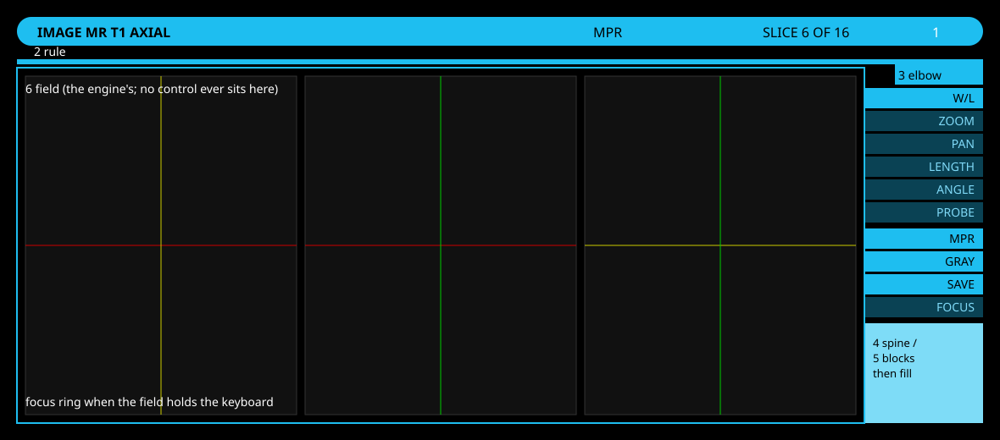

= ARGUS components: the reference
Rudolph Pienaar <rudolph.pienaar@gmail.com>
:doctype: article
:toc: left
:toclevels: 3
:sectnums:
:icons: font

[abstract]
== Abstract

AEGIS (`aegis.adoc`) is the doctrine: what the surface is, and the laws it keeps. This document is the reference beneath it: the components a pane is built from, one section each, in the shape a component library owes its users. A section says what the component is for, what it looks like (its anatomy, drawn and labelled in `images/`, and once the component is on stage, photographed in each of its states by the smoke driver), what a pane declares to get one, the states it can be in, the laws it carries so a pane does not have to, the stylesheet hooks it wears, and what not to do with it.

A component lands with its section, in the same pull request, and the section is amended by every slice that changes the component. A section, like the component it describes, speaks the component's own vocabulary and names no theme: colour reaches a component as tokens, and the doctrine above this reference is where the theme is named. The lint gate holds this table to the tree: every section names its source, and the sources that are components must have a section.

== Reading a section

Each section follows one order. *Purpose* says what the component answers. *Anatomy* opens with the drawing, then names its parts, outermost first, with the class each part wears; a component on stage adds a picture per state. *Declaration* is the TypeScript a pane writes, complete, with every optional field explained. *States* are the classes a part can wear and what puts them there. *Laws* names the AEGIS laws the component expresses as consequences of its declaration. *Stylesheet* lists the custom properties and selectors a theme may touch and the ones it may not. *Do not* lists the ways the component has been misused, or would be.

== Listing

Source: `apps/argus/src/features/roster/listing.ts` (the façade), over `order.ts` (sort and filter), `host.ts` (frame and field) and `row.ts` (traits, actions, progress, expansion).

Status: on stage in every tabular pane — the browser (2026-09-07, S2), the runs roster (2026-09-08, S3), PACS with its three levels (2026-09-08, S4), and the DICOM tags pane with four (module groups, tags, sequence items, their tags; 2026-09-09). No pane composes a listing by hand; the lint fails one that tries. The browser was the first pane converted, and its conversion is what turned this section from a declaration into a description of a thing that runs.

=== Purpose

A listing shows rows of one kind under column caps that sort them, behind a filter strip that narrows them, with a frame that stays while the rows scroll. It is the one tabular pattern of the surface: a directory's entries, a session's feeds, a query's studies and their series are all listings. A pane declares one and calls `rows_set`; it never assembles caps, strip, track or selection itself.

=== Anatomy

.The listing, numbered: frame and field, a block with a lead row, an indicated row with its verbs and readout, a selected row, an open row with its level, a second block, and the chrome that reads its state
image::images/listing-anatomy.svg[Listing anatomy,1180]

[cols="1,1,3"]
|===
| Part | Class | Holds

| grid host | (the mount, or `gridHost`) | The custom property `--roster-cols`, written by the façade from the traits. Every part below reads it.
| frame | `.roster-order` | The caps row and the filter strip, seated at the head of the mount, never re-inserted.
| caps | `.roster-caps` › `.roster-cap` | One cap per capped trait, blank cells over uncapped traits; the active cap wears `.roster-active` and its direction glyph.
| strip | `.roster-filter` › `.roster-filter-input` | The filter, hidden until FILTER or the language opens it.
| field | `.listing-field` | The scrolling region beneath the frame, opened fresh on every render.
| block | `.listing-block` | One group of rows: a header when given, its own caps when `caps: 'each'`, then its rows or its painted form.
| rows | `.listing-rows` | The rows of one block.
| row | `.listing-row` | A grid on `--roster-cols`: one cell per trait, then the action track when actions are declared.
| control | `.listing-control` on the declared `control` trait's cell | A capsule that says what a press does — OPEN / CLOSE on a folding row, where the fold's state is the news; in the browser the kind's own glyph (the console's folder, file, cog) capped when the row opens, bare when it opens nothing, `..` wearing the folder like any directory; activates the row on a press and does nothing else.
| cell | (the trait's `className`) | What one trait says about one row.
| action track | `.listing-actions` | On a listing whose verbs stay on the row: reserved on every row at one declared height; holds the verbs of the indicated row, or every row's under `always`. Absent on a listing that declares a row zone.
| verb | `.listing-action` | One capsule, one command.
| readout | `.listing-readout` | Words beside the verbs — beneath them, in the row zone — about the indicated row only.
| level | `.listing-level` | A child listing beneath an open row: its own `--roster-cols`, its own caps, its rows.
| row zone | `.listing-zone` (also `<prefix>-row-zone`), minted by the façade into the mode frame beside the mount, above its fill | On the mode frame beneath the blocks that act on the field: the indicated row's verbs one under another with its readout beneath, or the selection's verbs while SELECT is on. Empty and hidden when nothing is indicated or selected; verbs arriving open the frame.
|===

=== Declaration

[source,ts]
----
const listing = new Listing<FsListingEntry>({
  mount: panel,                       // the listing region
  traits: FILE_TRAITS,                // columns, each with a width; an uncapped one leads
  key: (entry) => entry.path,         // one string per row
  chrome: { root: pane, prefix: 'files' },
  rowZone: pane.querySelector('.files-row-zone'),   // the verbs ride the frame: no track
  actions: { of: (entry) => verbs_for(entry) },      // a row offered none keeps one click
  activate: (entry) => open(entry),
  activatable: (entry) => entry.type !== 'unknown',
  indicated: (entry) => regard_write(entry.path),
  row: { className: (entry) => `files-type-${entry.type}`, decorate: (el, entry) => { el.title = entry.path; } },
  selection: { verbs: (rows) => selectionVerbs_for(rows) },
  state: (parts) => ['CWD', listingState_compose(parts)].filter(Boolean).join(' · '),
  defaultSort: { key: 'name', dir: 'asc' },
});
listing.rows_set([{ key: '/x', lead: [UP], rows: entries }], { field: '/x' });
----

[cols="1,3"]
|===
| Field | Meaning

| `mount` | The listing region. The frame seats at its head; the field opens beneath it.
| `traits` | The columns, in cap order. Each is a `ListingTrait`: key, label, `className`, `cell`, optional `compare`, and its `width` (a CSS grid track, required by the façade). `capped: false` makes a leading ornament: a track and a cell, no cap, no sort. Uncapped traits must lead; the façade refuses a declaration where one follows a capped trait.
| `key` | A row's identity as a string. Indication, selection, readouts and `row_element` are all keyed by it.
| `gridHost` | Where `--roster-cols` is written; defaults to the mount. A pane whose query form stands on the same grid outside the mount names an ancestor of both, and `template_get()` gives the form the template.
| `chrome` | The pane root and the block prefix. The façade finds `.pane-state`, `.<prefix>-filter` and `.<prefix>-select` under the root, binds them, and listens for `argus:roster` on the root. Absent, the listing has no chrome and writes no state line.
| `rowZone` | Rarely declared: a mount that stands in a framed field (a `.mode-frame` beside it) gets its zone MINTED there by the façade, above the frame's fill, wearing `.listing-zone` and `<prefix>-row-zone`. Name one only for a mount framed some other way. With a zone the listing's verbs ride the frame: no level mints a track (`actions.width` is not read), the mount wears `.listing-framed`, the indicated row's verbs are drawn in the zone and its readout beneath them, and a selection's verbs ride the same zone. Verbs arriving open the frame the zone stands on (`data-modes` on its `.workspace-pane`); the last of them leaving retracts it unless the operator opened it or has since pressed another block on it; the frame retracting stands the row down. A listing with no frame keeps the in-row track.
| `caps` | `root` (default) keeps one caps row in the frame; `each` mints a caps row at the head of every block instead, all reading one sort.
| `actions` | The row verbs. Without a `rowZone`, declaring this mints the action track: a track of `width` on every row, empty until the row is indicated, then holding `of(row)`; with one, no track, and `of(row)` is drawn in the zone. A row `of` offers nothing keeps its single click — a lead row too, so `..` enters on one click while `.` is offered the place's verbs and indicates. A level with a declared `control` keeps navigating apart from selecting: the control cell activates and selects nothing, the rest of the row selects and does not activate; without one, a folding row's click folds and indicates at once and a replacing row keeps click-indicates, double-click-goes. No double-click on a folding row. `always: true` draws every row's verbs at once and the click activates instead of indicating.
| `activate` | What activating a row does. With a `child`, activation also folds the row open or closed.
| `activatable` | Whether a row answers a click; absent means every row does. A row that does not wears no cursor and no listener.
| `indicated` | Told when a row is indicated, for the regard.
| `row` | The pane's own row-level concerns: extra classes (row state marks a row, not a column) and a decorator for title, dataset, whatever else.
| `selection` | Declaring this makes the listing able to SELECT: `verbs(rows)` gives the verbs for the current selection, drawn in the row zone, each one command over many operands. Requires a `rowZone`; the façade refuses a selection with nowhere to put its verbs.
| `state` | Composes the state line from typed parts (`filter`, `selecting`, `selected`, `shown`). Absent, `listingState_compose` writes `SELECT · FILTERED n/m · k SELECTED · s SHOWN`, each part only when it has something to say. Returning null leaves the span untouched, for a pane whose bar is saying something else.
| `defaultSort` | The initial sort.
| `control` | The key of the trait whose cell is the row's control: a press there activates the row (folds it on a level with a child; enters or opens it on one that replaces the listing) and does nothing else, while a press elsewhere on the row indicates it without activating. The cell wears `.listing-control`. Draw it as a capsule that reads what it will do next (OPEN / CLOSE from the group's state, OPEN, UP), ≥24px, inset so a miss lands on nothing; the façade refuses a `control` naming no trait.
| `child` | The level beneath: `listingChild_declare(of, declaration)`, where `of` gives a row's children and `declaration` is a `ListingLevel` for them (traits, key, actions, activate, its own `child`). A row that heads a level is wrapped with it in a `.listing-group` (plus `row.groupClassName`), which wears `.listing-open` while the row is open; the level beneath carries `data-depth` (1, 2, …) so a stylesheet indents by depth. The child's caps are minted per open row on the child's own grid, the parent's filter is read down the levels, and a parent survives the filter when a child matches. Activating a row folds it; `open_set(depth, keys)` holds rows open programmatically and `open_clear()` closes every level; `template_get(depth)` gives a form the level's template.
| `empty` | What the field says when blocks were set but hold no rows (an answer with nothing in it), as against no blocks at all (no answer yet), which says nothing.
|===

The methods a pane calls afterwards: `rows_set(blocks, { field })`, `row_indicate(key | null)`, `indicated_get()`, `indication_refresh()`, `readout_show(key, text)`, `row_element(key)`, `template_get()`, `painter_set(paint | null)`, `filter_toggle(open?)`, `select_toggle(on?)`, `select_isOn()`, `selection_get()`, `state_refresh()`.

A block is `{ key, header?, lead?, rows }`. A flat listing passes one; a browser listing several directories passes one per directory with a header each. `lead` rows are drawn before the ordered rows and stand outside the order: never sorted, filtered, counted or selected. Whether one has verbs is the roster's call as for any row: the browser's `..` has none and its UP capsule activates it. It wears its label on the capsule and no name beside it, and, being navigation and never the block, stays lit while the field recedes. A painter (`painter_set`) draws a block some other way, cards say, and receives the rows already ordered; a painted block has no grid, so its rows carry no track and no indication, and the painter owns what a click means.

As the browser uses it: one block per listed directory, each led by its `..` as a lead row; the row type carries the entry and the full path it sits at, since a listed name does not know its own directory. The card and preview projections are a painter; the cwd binding, the stale readout and the content views (a file, an image, a /bin entry) are the browser's own, layered around the listing rather than inside it. The browser declares its row zone and a control column, the kind's glyph in a capsule of the kind's console colour: a press enters a directory (`..` included), shows a file or graphs a catalogue entry, while its body puts the row's verbs in the frame — DOWNLOAD / MOVE / COPY / DELETE for a file, MOVE / COPY / DELETE for a directory, IMAGE and those for a DICOM series folder, SHARE FEED n inside a feed. What acts on the place on stage rides the frame (MKDIR, UPLOAD, REFRESH); the place is acted on as a row from its parent. A node overlay declares no verbs and no zone, so it keeps its single click. The same pane built with `{ catalogue: true }` is a CATALOGUE, and its header says so: `/bin` in catalogue traits (NAME / TYPE / VERSION), bound to an input by `binding_set` (a run strip above the listing, wrapping rather than overflowing a narrow pane: the binding readout, the editable line, and after a run a lit FEED capsule via `run_show`), its plugin rows offered RUN by the roster. In a bound catalogue the graph is the form: a plugin's one-node graph dives itself, the dive's parameter rows are VALUE cells (`.telemetry-input`, a check for a boolean) that write their flag into the strip's line through `features/files/runLine.ts` (`runLine_flagSet` / `runLine_flagGet`: the line is the only state, a hand edit stands), a pipeline node dives as `title · @id` editing `--<node>.<param>`, and RUN rides the diagram frame (`.diagram-run`) beside RANKED / 3D / PULSE. A catalogue leads with a RECENT block (`recent_set`, rows keyed under `/bin/recent`): the operator's lately-run executables from the kernel's `plugininstance.list` model, newest first. As a desktop it is the action `catalogue` (input, feed, node, the line verbatim) and a run's graph beside it the action `graph` (feed); restore returns the bound listing with its line, not the dive.

As PACS uses it: three levels, patient over study over series, one row zone for all three; the fold glyph is each folding row's own uncapped leading trait, drawn by the stylesheet from the group's open state; a level of one row is opened with `open_set`; a patient's and a study's fold cell (`control: 'fold'`) folds the row and nothing else, a study's body puts PULL STUDY in the frame, a series click puts GATHER / IMAGE / DIR / PULL there, and `indication_refresh` re-lights them on every stage change (GATHER from the cohort pane's answer, `gathered_is`); the workspace carries the study template from `template_get(1)` for the form, whose QUERY stands in the SERIES column; the summed progress bars and the per-series badges remain the pane's, painted into mounts its own cells register.

The progress track reads its own state, drawn by `progressCell_build`: an idle track when nothing is scheduled (a dim wash, never absent — nothing has happened yet is not the same as there is no such thing), a bright fill while running, a recessive fill when finished (`--pumpkin-pie`, the dark tone the ID/owner/created columns trade away to `--daybreak`, so a roster of finished feeds sits back and the running bars stand out), and, when the work errored, a fill in the error hue only as long as the work that succeeded (`successfulNodes / totalNodes`) — its length is how far the feed got before it died, not a full red bar that says nothing. The failed count reaches a roster row as `jobsErrored`; the fill falls back to the settled count without it.

As GATHER uses it (`features/gather/panel.ts`, pane kind `gather`, born below the PACS results by `gather_open` and joined to its group): two levels, the cohort row (`control: 'fold'`, opened by `open_set` since a level of one opens itself) over its series rows, keyed by series UID; the cohort row's body puts SAVE / EXPORT CSV / CREATE FEED / PROCESS / DISMISS in the row zone (PROCESS makes the cohort's feed if it has none, from the kernel's `feed.created` answer to `pull --new-feed`, then opens a catalogue bound to the feed's root; CREATE FEED is withdrawn once a feed exists; a FEED trait lights `FEED N` as a capsule opening the graph), a series row's REMOVE / IMAGE / PROCESS, both from the `gather.cohort` and `gather.series` rosters; the bar counts `n SERIES · m PATIENTS`; SAVE, EXPORT CSV and CREATE FEED ask the cohort's name once (`name_ask`) and lower to one visible command each; as a desktop the pane is the action `gather` (series, name, and the feed with its root when one was made).

As the roster uses it: one block, the constant field `roster`; a leading control column whose OPEN enters the feed, the row's body selecting it and putting SHARE / DELETE and the grant readout in the roster's own frame; PROGRESS is the expanse right after TITLE; the surface's row verbs are declared at construction (a roster given none keeps its single click); a feed's arrival pulse is a mark toggled on `row_element(key)` between renders; and the state composer yields the bar to the graph (returns null) whenever a graph rather than the roster is on stage. The pane's forwarders stringify the feed id at the boundary, since the façade keys rows by string.

=== States

[cols="1,1,3"]
|===
| State | Class | Put there by

| indicated | `.listing-indicated` on the row | A click on a row of a listing with actions (outside its control cell, when it has one), or `row_indicate(key)`. Exactly one row at a time across every level; the previous row stands down. Belongs to the field: restored after a repaint of the same field (a fold, a sort, a re-listing), gone with a row that left, cleared by navigation. `indication_refresh()` redraws its verbs from their live predicates.
| selected | `.listing-selected` on the row | A click while SELECT is on, on a governed row. Kept across renders of the same field.
| selecting | `.listing-selecting` on the mount | `select_toggle`. The SELECT block reads `SELECT ON` and loses `rail-off`.
| framed | `.listing-framed` on the mount | A declared `rowZone`. The indicated row is drawn as a segment of the frame — the frame's block colour, black type, reaching the spine, its bars in black — and while one is, every other row recedes to a quarter (hover restores; not while selecting), so the block and the frame's verbs read as one pair. The zone wears `.listing-zone`.
| open | `.listing-open` on the row | Activation of a row that has a child level; its level follows it.
| activatable | `.listing-activatable` on the row | Any row `activatable` does not refuse.
| filtered | `FILTER ON` on the block, `FILTERED n/m` on the bar | The strip opening; the counts are taken across every block.
|===

Row state that belongs to the pane (a refused read, an arrival, a status) goes through `row.className` at build or `row_element(key)` between renders; it is a mark on the row, never a column.

=== Laws

`a-row-is-indicated-before-it-is-acted-on`. Declared actions split click (indicate) from double-click (activate) on every row that is offered one; no actions, or a row offered none, means one click. Where the verbs stay on the row the track is present on every row at the height `.listing-actions` declares, so indicating changes what the track holds and never the geometry around it.

`a-row-s-verbs-live-in-the-frame`. A listing that declares a `rowZone` reserves no track: the indicated row's verbs are drawn in the frame's row zone, the row is drawn as a segment of the frame, verbs arriving open the frame, the last of them leaving retracts it unless the operator holds it, and the frame retracting stands the row down. A selection's verbs ride the same zone.

`a-selection-belongs-to-the-field`. `rows_set` names the field. The same name is the same field, so the selection survives a filter and a re-listing; a different name is navigation, so the selection clears. Leaving SELECT clears nothing. The selection's verbs ride the frame's row zone, not any row.

`caps-are-the-sort` and `roster-grid-single-source`. The caps are the frame, the track list is computed once from the traits and written as `--roster-cols`, and caps and rows read it alike. A pane never states a column count; the façade refuses a trait without a width at construction, so a miscount is a boot error and not a shifted row.

`listing-is-one-abstraction`. A pane declares its listing and never builds one. Reaching past the façade — to `RosterOrder`, `ListingHost`, the row or capsule builders, or a hand-typed `--roster-cols` — is the violation the lint names (S5); the PACS pane carries the one allowance, printed as debt, until S4.

=== Stylesheet

A track is a fixed length, or the listing's one expanse (`1fr`). Never a track sized to its content — `auto`, `minmax(0, …)`, `min-content`, `max-content`, `fit-content` — because a row is its own grid, and a content-sized track sizes per row: a short value narrows the track for that row alone and every column after it jogs. A listing that carries progress makes PROGRESS the expanse, right after its description column, with the trailing facts and the verbs after it. Levels beneath a level share the expanse's left edge: the leading tracks are the same widths on every level (or the child's description is widened to make up the difference), so the bars line up level over level. Every row and caps row of one listing shares one font size, since the tracks are in em. The façade refuses a content-sized track at construction (`listingTemplate_of` throws on `auto`, `minmax(0, …)` and the content keywords). The alignment across levels is declared, not computed: a level's leading tracks are given the same widths as its parent's (or its description widened by the difference), and the smoke suite measures the result.

A theme may set, per pane: `--roster-gap` and `--roster-pad` on the grid host, the hues of `.listing-indicated` and `.listing-selected` and the framed row's block (`.listing-framed .listing-indicated`: the frame's block colour with black type), and the per-trait cell rules the trait's `className` names (alignment lives there, right-aligned numbers included). The row zone's capsules are `.listing-action` wearing the frame's geometry (`.mode-frame .listing-zone .listing-action`: full width, square, right-aligned, a label that wraps rather than cuts). A control IN a row — a fold cell, the browser's UP and OPEN — is a capsule in the frame's hue, dim at rest, lit on hover, inverted on the indicated block; never a bare glyph. The browser's kind glyphs and per-kind colours are the console's (`--console-<name>`, published by the terminal from its own palette; the Nerd Font icons of `colors.yml`), held equal by a unit test. A theme may not write `--roster-cols` on a converted pane, since the façade owns it; nor size `.listing-action`, whose height is declared once and read by the track that reserves room for it.

=== Do not

Do not size a track to its content, and do not put the expanse at the end of the row: a bar packed against the right edge after every fact is a readout nobody scans. Do not append a cell to a row outside the traits and the declared actions: a row one cell short or long shifts every cell of every row after it. Do not hold a row's element across a render; `rows_set` rebuilds the field, so ask `row_element(key)` again. Do not clear the selection from a pane; name the field and let the façade decide. Do not put a verb in a column; a verb answers to no cap and lives in the track or, on a framed listing, in the row zone. Do not find the row zone by prefix; declare it, since declaring it changes the grid. Do not use a painter to add a column; a painter replaces the grid, it does not extend it.

== Image pane

Source: `apps/argus/src/features/image/panel.ts` (the pane), over `engine.ts` (the seam), `cornerstoneEngine.ts` (DICOM series on Cornerstone3D) and `niivueEngine.ts` (NIfTI and MGZ on niivue).

Status: on stage since 2026-09-09 (S3 of the DICOM campaign, epic #359). Opens from `image <path>`, from a `.dcm` or volume row in a browser, from the IMAGE verb on a series folder's row, and from the IMAGE verb on a pulled PACS series. The TAGS block and the slaved tags pane arrive with S4; the LOAD guard on volume layouts with S6.

=== Purpose

An image pane shows one DICOM series or one volume file on a guest engine's field, inside mise's frame. The field is the engine's: pixels, window and level, scroll, zoom, pan, length, angle, probe, crosshairs, every behaviour and its defaults. The frame is mise's: one block per library tool, LAYOUT, COLORMAP, SAVE, and the FOCUS mark. The bar reads the slice on screen, the layout when it is not the default, and what could not be read; the console gets the same lines.

=== Anatomy

.The image pane, numbered: the bar (1), the rule (2), the elbow (3), the spine widened into the frame (4) with its blocks (5), and the engine's field (6)

[cols="1,1,3"]
|===
| Part | Class | Holds

| pane | `.pane-image` | `data-modality` (MR, CT, PT, OT, NIFTI): the hue the frame wears.
| bar | `.pane-handle` | `.pane-title` `IMAGE <modality> <description>`, `.pane-mode` the layout when not single, `.pane-state` the readout: `OPENING`, `LOADING n OF m` while the stack fills, `SLICE n OF m`, `SLAB · z n / m`, `SERIES <size> · LOAD FOR STACK\|MPR\|3D\|SLAB` while the guard holds, `MPR · m SLICES`, `REFUSED n OF m`, `UNSUPPORTED TRANSFER SYNTAX <uid>`, `NOT A READABLE SERIES`.
| working note | `.image-working` | Stands on the field while something is arriving: `.image-working-label` (`OPENING <name>`, `READING n SLICES`, `BUILDING MPR`), `.image-working-track` with its `.image-working-fill` (pacing when the length is unknown), `.image-working-count` `done / total · nn%` when counted. With `.image-working-failed` it is the notice of what could not open: the reason as the label, the path asked for as the count line, no track.
| body | `.image-body` | The frame members and the field; shadows the frame's hue token for the modality.
| frame | `.field-rule` `.mode-strip` `.mode-elbow` `.mode-frame` | The mode frame every pane wears; a strip at rest. The strip's top-right wears the elbow's sweep (22px), so the join stays round while the strip breathes; the elbow reaches `--elbow-clear` (36px) into the field past the spine and its fillet is cut in page, so every roster grid keeps that much clear on its right.
| tool blocks | `.image-tool[data-tool]` | One per tool: `wl`, `zoom`, `pan`, `length`, `angle`, `probe`. The one on the primary drag is lit, the others `rail-off`; a tool the current layout does not offer is `rail-na` (line-through) and disabled. A stack offers all six; an MPR plane offers the pointer tools and the navigators, resting on the crosshair with none lit until one is chosen (click it again for the crosshair); a 3D render offers only `zoom` and `pan` (rotate/zoom/pan on the three mouse buttons at once). Five are the library's; `probe` is the pane's own readout (below).
| probe note | `.image-probe-note` | While `probe` is the tool and the pointer is on the image: `X i  Y j  ·  SLICE k  ·  value HU` at the foot of the field. Gone when the pointer leaves; nothing is drawn on the image.
| overlay note | `.image-overlay-note` | The header on the image while OVERLAY is on: `.image-overlay-slice` first, `SLICE n OF m` following the wheel (hidden for a single slice), then the study's and patient's lines read once per series.
| layout block | `.image-layout` | Cycles SINGLE, MPR, 3D, SLAB.
| SLAB scene | `.image-render` `.image-viewport-render` `canvas` | SLAB's own vtk render window (not a Cornerstone viewport): a ghost volume render and a crisp `vtkImageSlice` at the current slice. Left-drag rotates, the wheel sweeps, the bar reads `SLAB · z n / m`; `image ghost <0..1>|off` tunes the ghost.
| colormap block | `.image-colormap` | Cycles GRAY, HOT, JET, COOL.
| save block | `.image-save` | The measurements as a DICOM SR under `~/annotations/<SeriesInstanceUID>/`.
| preset block | `.image-preset` | Cycles the modality's window presets; hidden where the modality has none.
| load block | `.image-load` | Shown while the stack or a volume layout waits on the guard; pressing it consents: the waiting layout is applied, or the rest of the stack is fetched.
| focus mark | `.image-focus` | Shown while the field holds the keyboard.
| field | `.image-field` | The engine's mount; `tabindex=0`; holds `.image-viewport` elements or an `.image-canvas`, never a control.
|===

=== Declaration

[source,ts]
----
const panel = new ImagePanel(mount, {
  source: { url_of: vfsUrl_build },                 // bytes reach the engine through mise only
  note: (line) => terminal.line_note(line),         // the engine's events, as console lines
  regard: (path) => subjects.regard_write(id, { address: path, modelKind: 'dicom.instance' }),
  file_put: (path, blob) => fetch(vfsUrl_build(path), { method: 'POST', body: blob }).then((r) => r.status),
});
await panel.series_show(model, { siblings, startAt });   // a dicom.series model from the kernel
await panel.volume_show('/home/me/uploads/t1.nii.gz');   // a NIfTI or MGZ path
----

`series_show` reloads every annotation file the model lists (the kernel found them by SeriesInstanceUID under `~/annotations/`) onto the field once the engine is up, and says in the console how many measurements each held. It takes the kernel's `dicom.series` model: the ordered files become `wadouri:` image ids over `/vfs`, one per file, so the first slice is on screen after one fetch. `siblings` lists the other series of a study folder for `image series <n>`; `startAt` is the one-based slice to open on. `volume_show` hands the path to niivue. Every verb (`layout_set`, `slice_set`, `wl_set`, `wlPreset_set`, `colormap_set`, `tool_set`, `annotations_save`) returns whether the engine honoured it, and the pane writes a console line when it did not.

=== States

* `data-modality` on the pane: which hue the frame wears.
* `.image-field-focused` on the pane and the FOCUS mark shown: the field holds the keyboard.
* `.pane-mode` non-empty: a layout other than single.
* `rail-off` on a tool block: not the bound tool.

=== Laws

`an-instruments-field-is-foreign` (no control inside `.image-field`; the lint reads the template), `focus-stays-in-the-field` (smoke), `series-loads-by-consent` (smoke), `an-annotation-is-a-file` (smoke), `frame-retracts-to-a-strip`, `a-control-lives-where-it-acts` (IMAGE on the row that holds the series), `hue-is-a-mode` (the modality on the frame), `a-readout-that-acts-says-so` (LOADING, REFUSED, UNSUPPORTED on the bar).

=== Stylesheet

A theme may set `--harvestgold` per `data-modality` on `.image-body` (the frame's hue); the field's background; `.image-field-focused .image-field` (the focus ring). It may not move anything into `.image-field`, size `.image-canvas` other than 100% of its mount, or restyle the engine's own overlays.

=== Do not

* Do not put a button, a readout or any control inside `.image-field`: the lint fails the template. What acts on the field rides the frame.
* Do not fetch bytes anywhere but through `ImageSource`: the engine never talks to CUBE.
* Do not draw a tool behaviour of your own: bind the library's, or say by name that the engine lacks it.
* Do not swallow Esc in the field: it gives the keyboard back, one press, one level.
